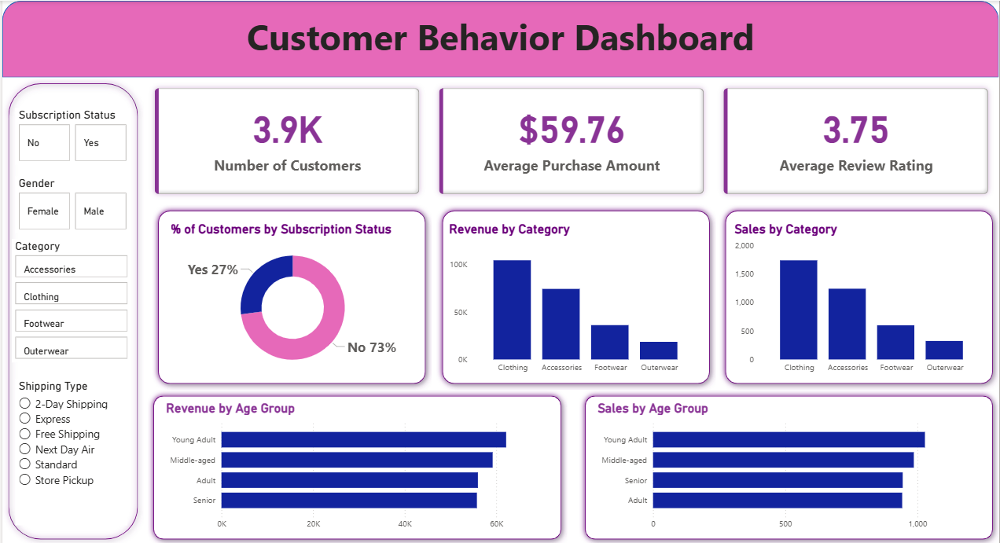

# 🛍️ Customer Shopping Behavior Analysis

**An end-to-end data analytics project** — from raw data to business recommendations — analyzing 3,900 retail transactions to uncover what drives customer spending, loyalty, and engagement.

---

## 📌 Overview

A retail company wanted to understand its customers' shopping behavior to improve sales, satisfaction, and long-term loyalty. This project answers the business question:

> **How can the company leverage consumer shopping data to identify trends, improve customer engagement, and optimize marketing and product strategies?**

The project covers the full analytics pipeline: **data cleaning → SQL analysis → dashboarding → reporting → presentation**, using a dataset of 3,900 transactions across 18 features.

---

## 🧰 Tools & Skills Demonstrated

| Area | Tools / Skills |
|------|-----------------|
| Data Cleaning & Feature Engineering | Python, pandas, Jupyter Notebook |
| Database & Querying | PostgreSQL, SQL (CTEs, window functions, aggregations) |
| Data Visualization | Power BI (interactive filters, KPI cards, charts) |
| Business Communication | Report writing, stakeholder presentation (PPT) |
| Core Competencies | Data storytelling, business insight generation, EDA |

---

## 🔍 Project Workflow

**1. Data Preparation — Python** (`Customer_Shopping_Behavior_Analysis.ipynb`)
- Explored the dataset with `df.info()` / `df.describe()`
- Imputed 37 missing `review_rating` values using category-level medians
- Standardized columns to snake_case; removed redundant `promo_code_used`
- Engineered `age_group` and `purchase_frequency_days` features
- Loaded the cleaned dataset into PostgreSQL for analysis

**2. Business Analysis — SQL** (`customer_behavior_sql_queries.sql`)
- 10 queries answering real business questions: revenue by gender & age group, discount-driven behavior, top-rated products, shipping type comparison, subscriber value, and RFM-style customer segmentation (New / Returning / Loyal)

**3. Dashboard — Power BI** (`customer_behaivor_dashboard.pbix`)
- Interactive filters: subscription status, gender, category, shipping type
- KPIs: total customers, average purchase amount, average review rating
- Visuals: revenue & sales by category and age group, subscriber split

**4. Reporting & Presentation**
- `Customer_Shopping_Behavior_Analysis.pdf` — full analytical report
- `Customer-Shopping-Behavior-Analysis.pptx` — stakeholder-ready presentation

---

## 💡 Key Insights

- 💰 Male customers generated **2x more revenue** than female customers ($157,890 vs $75,191)
- 🚚 Express shipping customers spend slightly more on average than Standard shipping customers
- 📉 Non-subscribers drive **significantly more total revenue** than subscribers, despite similar average spend
- 🏷️ Hats, Sneakers, and Coats are the most discount-dependent products
- 🏆 The majority of customers (3,116 of 3,900) fall into the **"Loyal"** segment
- 👥 Young Adults contribute the highest revenue among all age groups

## ✅ Business Recommendations

- **Boost Subscriptions** — promote exclusive benefits to convert non-subscribers
- **Loyalty Programs** — reward repeat buyers to grow the Loyal segment further
- **Review Discount Policy** — balance sales boosts against margin control
- **Product Positioning** — spotlight top-rated, best-selling products in campaigns
- **Targeted Marketing** — prioritize high-revenue age groups and express-shipping users

---

## 📁 Repository Structure

| File | Description |
|------|-------------|
| `Business_Problem_Document.pdf` | Original business problem statement |
| `Customer_Shopping_Behavior_Analysis.ipynb` | Python data cleaning & feature engineering |
| `customer_behavior_sql_queries.sql` | SQL business analysis queries |
| `customer_behaivor_dashboard.pbix` | Power BI interactive dashboard |
| `Customer_Shopping_Behavior_Analysis.pdf` | Full project report |
| `Customer-Shopping-Behavior-Analysis.pptx` | Stakeholder presentation |
| `assets/dashboard.png` | Dashboard preview image (used in this README) |

---

## 🚀 How to Explore This Project

1. Read `Business_Problem_Document.pdf` for context
2. Open the notebook to see the data cleaning process
3. Review the SQL file for the business queries and logic
4. Open the `.pbix` file in Power BI Desktop for the interactive dashboard
5. Read the full report or presentation for a summarized walkthrough

---

## 👤 About Me

Aspiring Data Analyst with hands-on experience in Python, SQL, and Power BI, passionate about turning raw data into actionable business insights.

📧 Email: *harshavardhanpundir332@gmail.com*
💻 Portfolio: *[add your portfolio link here](https://pundirharsh.github.io/harsh-portfolio/)*
